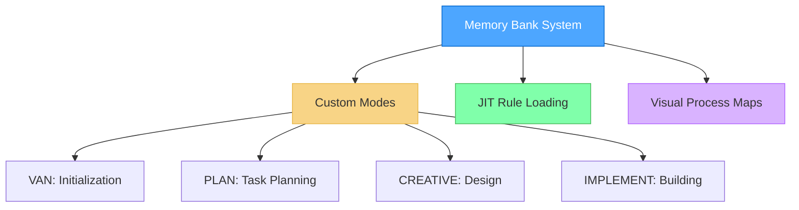
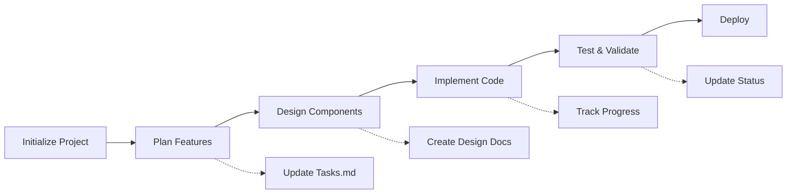
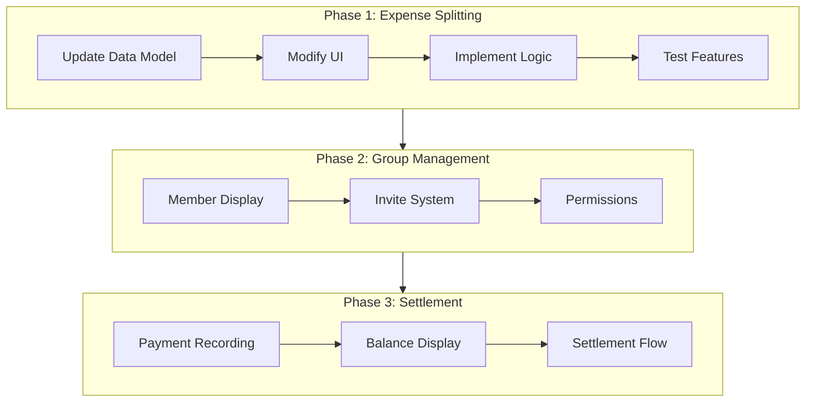

# System Architecture Diagram

```mermaid
graph TD
    Main["Memory Bank System"] --> Modes["Custom Modes"]
    Main --> Rules["JIT Rule Loading"]
    Main --> Visual["Visual Process Maps"]
    
    Modes --> VAN["VAN: Initialization"]
    Modes --> PLAN["PLAN: Task Planning"]
    Modes --> CREATIVE["CREATIVE: Design"]
    Modes --> IMPLEMENT["IMPLEMENT: Building"]
    
    style Main fill:#4da6ff,stroke:#0066cc,color:white
    style Modes fill:#f8d486,stroke:#e8b84d
    style Rules fill:#80ffaa,stroke:#4dbb5f
    style Visual fill:#d9b3ff,stroke:#b366ff
```

# Development Process Flow

```mermaid
graph LR
    A[Initialize Project] --> B[Plan Features]
    B --> C[Design Components]
    C --> D[Implement Code]
    D --> E[Test & Validate]
    E --> F[Deploy]
    
    B -.-> G[Update Tasks.md]
    C -.-> H[Create Design Docs]
    D -.-> I[Track Progress]
    E -.-> J[Update Status]
```

# Current Feature Implementation

```mermaid
graph TD
    subgraph Phase1[Phase 1: Expense Splitting]
        A[Update Data Model] --> B[Modify UI]
        B --> C[Implement Logic]
        C --> D[Test Features]
    end
    
    subgraph Phase2[Phase 2: Group Management]
        E[Member Display] --> F[Invite System]
        F --> G[Permissions]
    end
    
    subgraph Phase3[Phase 3: Settlement]
        H[Payment Recording] --> I[Balance Display]
        I --> J[Settlement Flow]
    end
    
    Phase1 --> Phase2
    Phase2 --> Phase3
``` 